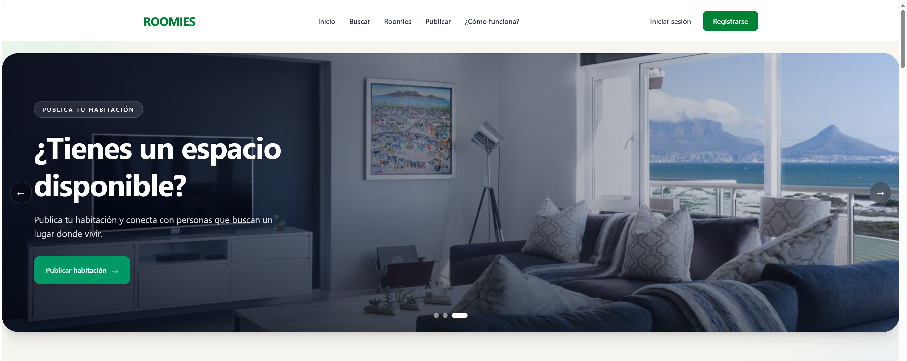
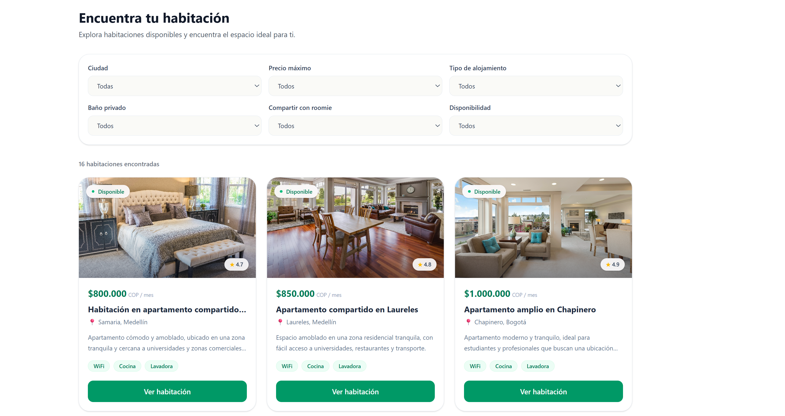
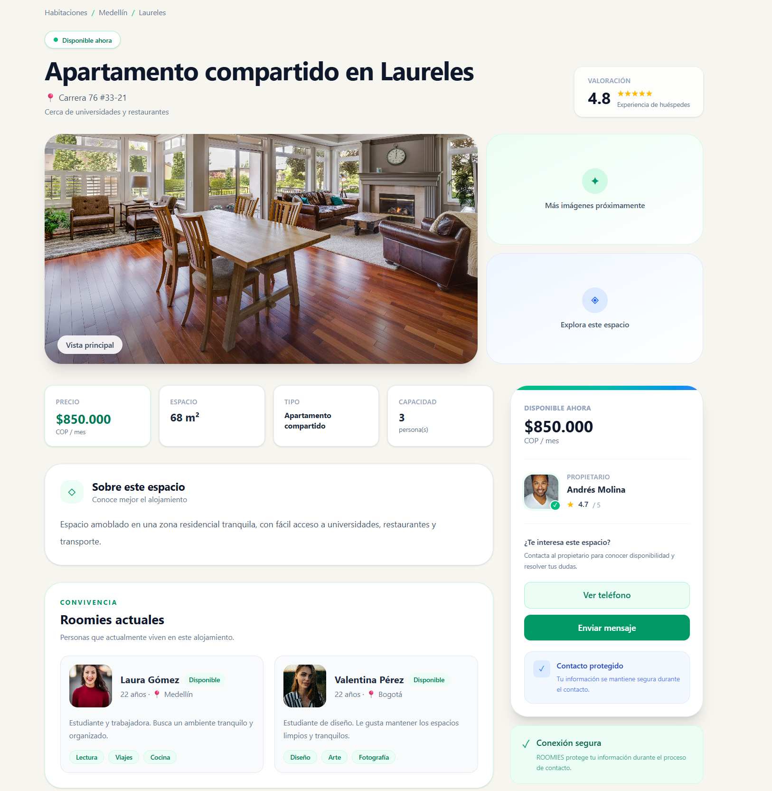
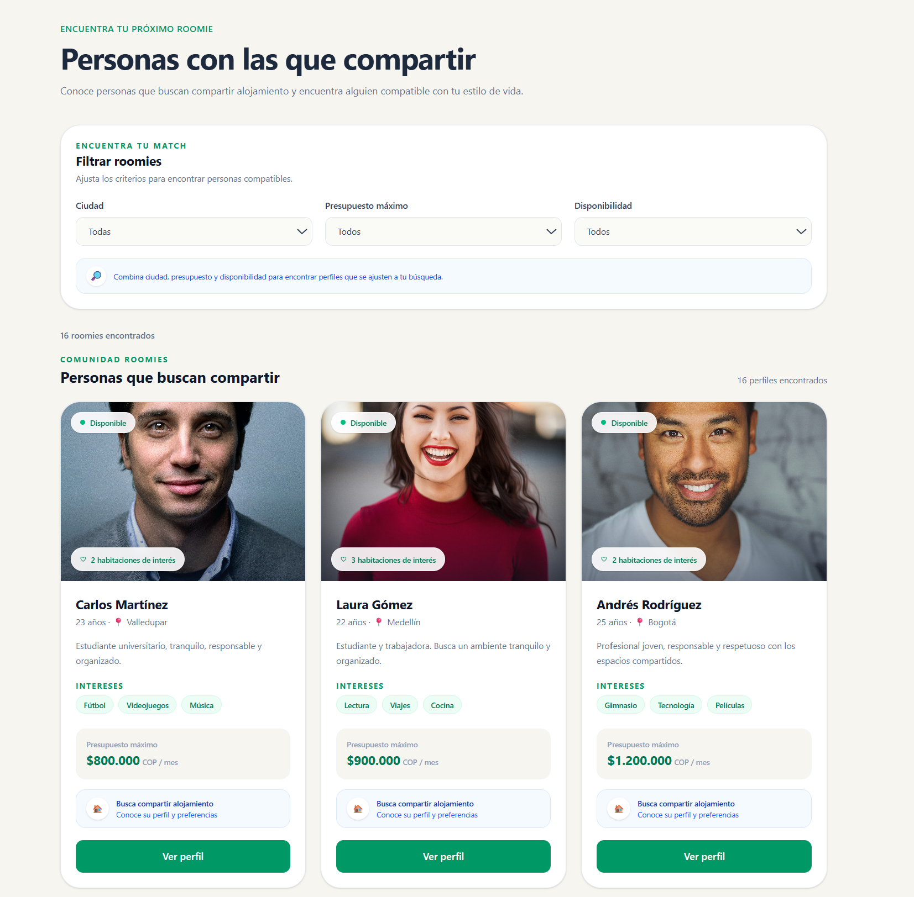
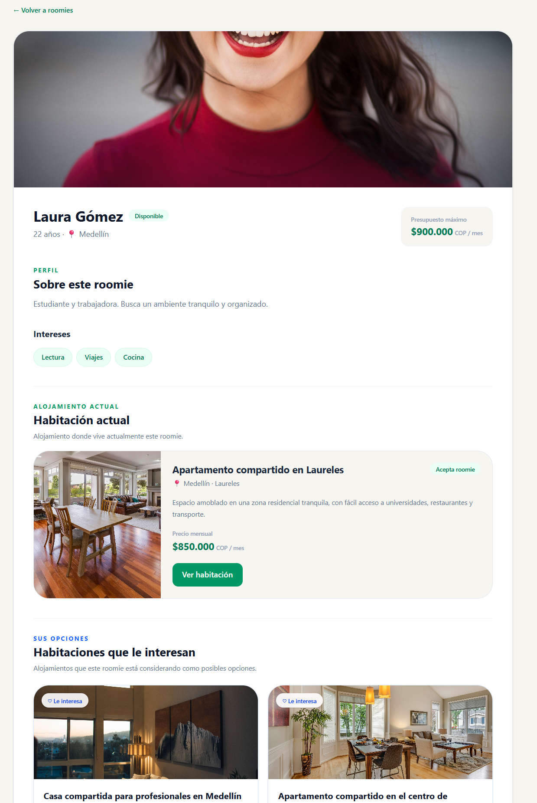

# 🏠 ROOMIES

ROOMIES es una plataforma web orientada a la búsqueda de habitaciones y compañeros de vivienda. El sistema busca facilitar la conexión entre personas que buscan alojamiento y propietarios que disponen de habitaciones, considerando características del espacio, presupuesto y preferencias de convivencia.

El proyecto se desarrolla con una arquitectura frontend/backend separada y aplica principios de diseño de software, separación de responsabilidades y patrones de diseño para facilitar su mantenimiento y evolución.

---

# 📸 Evidencias de la interfaz

## 🏠 Inicio


## 🏘️ Habitaciones


## 🏠 Detalle de habitación


## 👥 Roomies


## 👤 Perfil de roomie


---

## 📌 Repositorio

**GitHub:**
`[https://github.com/Sergio5423/roomies/tree/main]`

---

# 🎯 Objetivo

Desarrollar una plataforma web que permita a los usuarios:

* Explorar habitaciones disponibles.
* Filtrar habitaciones.
* Consultar el detalle de una habitación.
* Conocer las características y condiciones del alojamiento.
* Explorar perfiles de posibles roomies.
* Consultar intereses y preferencias de convivencia.
* Conocer el alojamiento actual de un roomie.
* Identificar habitaciones en las que un roomie está interesado.
* Preparar la aplicación para futuras funcionalidades de autenticación, reservas, persistencia y recomendaciones.

---

# 🛠️ Tecnologías utilizadas

## Frontend

El frontend está desarrollado con:

| Tecnología          | Uso                                     |
| ------------------- | --------------------------------------- |
| React 19.2.7        | Construcción de la interfaz             |
| TypeScript 5.9.3    | Tipado estático                         |
| React Router 8      | Navegación y definición de rutas        |
| Tailwind CSS 4.2.2  | Estilos y diseño responsive             |
| Vite 8.0.3          | Herramienta de desarrollo y compilación |
| @react-router/dev   | Desarrollo y build con React Router     |
| @react-router/node  | Integración con Node.js                 |
| @react-router/serve | Servidor de producción                  |
| isbot               | Detección de bots                       |

### Scripts principales

```bash
npm run dev
```

Ejecuta el frontend en modo desarrollo.

```bash
npm run build
```

Genera la compilación de producción.

```bash
npm run start
```

Ejecuta la aplicación compilada mediante React Router.

```bash
npm run typecheck
```

Genera los tipos de React Router y ejecuta la comprobación de TypeScript.

---

# ⚙️ Backend

El backend está desarrollado con:

| Tecnología       | Uso                                        |
| ---------------- | ------------------------------------------ |
| Node.js          | Entorno de ejecución                       |
| TypeScript 7.0.2 | Desarrollo tipado                          |
| Express 5.2.1    | Framework para la API                      |
| TSX              | Ejecución de TypeScript durante desarrollo |
| ts-node          | Ejecución de TypeScript                    |
| @types/express   | Tipado de Express                          |
| @types/node      | Tipado de Node.js                          |

### Scripts principales

```bash
npm run dev
```

Ejecuta el backend en modo desarrollo utilizando `tsx watch`.

```bash
npm run start
```

Ejecuta el backend mediante TSX.

```bash
npm run build
```

Compila el backend utilizando TypeScript.

---

# 🏗️ Arquitectura del proyecto

El proyecto se divide actualmente en dos aplicaciones:

```text
ROOMIES/
│
├── frontend/
│
└── backend/
```

El frontend utiliza una organización basada en rutas, componentes, dominio e infraestructura.

```text
frontend/
│
├── app/
│   ├── routes/
│   └── data/
│       └── mock/
│
├── components/
│   ├── habitaciones/
│   └── roomies/
│
├── domain/
│   ├── habitaciones/
│   └── roomies/
│
└── infrastructure/
    └── repositories/
```

El backend actualmente contiene la estructura inicial de una API basada en Express y TypeScript.

---

# 🧩 Patrón de diseño utilizado

## Repository Pattern

El frontend utiliza el **Repository Pattern** para separar la lógica de acceso a datos de los componentes de presentación.

Por ejemplo:

```tsx
export interface AccommodationRepository {
  getAll(): Promise<Accommodation[]>;
  getById(id: number): Promise<Accommodation | null>;
  getBySlug(slug: string): Promise<Accommodation | null>;
}
```

Actualmente se utiliza una implementación simulada:

```text
AccommodationRepository
        ↓
MockAccommodationRepository
        ↓
Mock Data
```

La arquitectura permite posteriormente implementar:

```text
AccommodationRepository
        ↓
ApiAccommodationRepository
        ↓
Backend Express
```

sin modificar los componentes que dependen de la interfaz.

---

# 🧱 Principios SOLID

La refactorización incorpora principios SOLID de manera práctica.

## SRP — Single Responsibility Principle

Las responsabilidades están separadas entre diferentes componentes y módulos.

Ejemplo:

```text
RoommateCard
→ representación visual del roomie.

RoommateFilters
→ filtros.

RoommateGrid
→ organización del listado.

RoommateRepository
→ contrato para acceso a datos.

MockRoommateRepository
→ implementación simulada.
```

## OCP — Open/Closed Principle

Los repositorios permiten agregar nuevas implementaciones sin modificar el contrato existente.

```text
AccommodationRepository
        ├── MockAccommodationRepository
        └── ApiAccommodationRepository
```

## LSP — Liskov Substitution Principle

Las implementaciones concretas de los repositorios pueden sustituirse mientras respeten el contrato definido por la interfaz.

## ISP — Interface Segregation Principle

Se utilizan interfaces específicas por dominio en lugar de una única interfaz con responsabilidades excesivas.

Actualmente existen, entre otras:

```text
AccommodationRepository
RoommateRepository
```

## DIP — Dependency Inversion Principle

El acceso a datos se define mediante abstracciones antes que mediante una dependencia directa de una fuente concreta.

La implementación actual puede evolucionar hacia una inyección de dependencias más completa cuando se integre la API definitiva.

---

# 🧪 Uso de Mock Data

Durante esta etapa el frontend utiliza datos simulados.

Esto permite:

* Desarrollar la interfaz sin depender completamente del backend.
* Probar los componentes.
* Simular diferentes escenarios.
* Mantener el contrato del repositorio.
* Facilitar la futura conexión con una API real.

El Mock no representa la solución definitiva de persistencia.

La arquitectura permite reemplazarlo posteriormente por un repositorio que consuma el backend.

---

# ✨ Funcionalidades implementadas

## 🏠 Habitaciones

* Listado de habitaciones.
* Búsqueda y filtros.
* Tarjetas de habitaciones.
* Página de detalle.
* Galería de imágenes.
* Precio.
* Amenidades.
* Reglas.
* Información del propietario.
* Ubicación.
* Habitaciones relacionadas.
* Información de ocupantes.

## 👥 Roomies

* Listado de roomies.
* Filtro por ciudad.
* Filtro por presupuesto.
* Filtro por disponibilidad.
* Perfil individual.
* Intereses personales.
* Presupuesto máximo.
* Habitación actual.
* Habitaciones de interés.

## 🔗 Relación Roomie ↔ Habitación

Se diferencia entre:

```text
habitacionId
```

que representa el alojamiento actual del roomie, y:

```text
habitacionesInteresadasIds
```

que representa las habitaciones que el roomie está considerando.

Un roomie puede estar interesado en varias habitaciones, pero solamente tiene un alojamiento actual.

---

# 🎨 Interfaz de usuario

La interfaz fue refactorizada para mantener una identidad visual consistente.

### Características principales

* Diseño responsive.
* Fondo crema.
* Tarjetas blancas.
* Verde esmeralda como color principal.
* Azul para información.
* Ámbar para valoraciones.
* Bordes redondeados.
* Sombras suaves.
* Estados visuales de disponibilidad.
* Transiciones y efectos de interacción.

La identidad visual busca transmitir una sensación de:

**hogar + confianza + tranquilidad + claridad.**

---

# 🔄 Cambios de la segunda entrega

Esta segunda entrega se enfocó principalmente en **refactorización, arquitectura, patrones de diseño, separación de responsabilidades y mejora visual**.

### Arquitectura

* Organización del frontend por dominios.
* Separación entre componentes y acceso a datos.
* Creación de interfaces de repositorio.
* Implementación de Mock Repositories.
* Preparación para una futura API REST.

### Habitaciones

* Refactorización del modelo de alojamiento.
* Implementación de `ocupantesIds`.
* Relación entre habitaciones y roomies.
* Mejora de la página de detalle.
* Incorporación de información adicional del alojamiento.

### Roomies

* Creación del dominio `Roommate`.
* Creación de `RoommateRepository`.
* Implementación de `MockRoommateRepository`.
* Creación de tarjetas.
* Creación de filtros.
* Creación del detalle del roomie.
* Relación entre alojamiento actual y habitaciones de interés.
* Implementación de múltiples habitaciones de interés.

### Interfaz

* Rediseño visual de las tarjetas.
* Mejora de la jerarquía visual.
* Identidad visual consistente.
* Nuevo diseño del Banner principal.
* Mejora de estados de disponibilidad.
* Mejoras visuales en las páginas de habitaciones y roomies.

---

# 🚀 Instalación

## 1. Clonar el repositorio

```bash
git clone [https://github.com/Sergio5423/roomies/tree/main]
```

## 2. Frontend

```bash
cd frontend
npm install
```

Ejecutar:

```bash
npm run dev
```

## 3. Backend

En otra terminal:

```bash
cd backend
npm install
```

Ejecutar:

```bash
npm run dev
```

---

# 🏗️ Compilación y validación

## Frontend

Comprobar tipos:

```bash
npm run typecheck
```

Generar build:

```bash
npm run build
```

## Backend

Generar build:

```bash
npm run build
```

El proyecto debe compilar sin errores antes de realizar la entrega.

---

# 🔌 Comunicación Frontend / Backend

La arquitectura está preparada para evolucionar hacia:

```text
┌──────────────────┐
│     Frontend     │
│ React + TS       │
└────────┬─────────┘
         │
         │ HTTP / REST
         ↓
┌──────────────────┐
│     Backend      │
│ Express + TS     │
└────────┬─────────┘
         │
         ↓
┌──────────────────┐
│ Base de datos    │
│     futura       │
└──────────────────┘
```

Actualmente el frontend utiliza Mock Repositories para la información de habitaciones y roomies mientras se desarrolla progresivamente la integración con el backend.

---

# 🚢 Proceso de despliegue

El proceso de despliegue proyectado para ROOMIES es:

```text
GitHub
   ↓
Git Flow
   ↓
Jenkins
   ↓
Pruebas
   ↓
Build
   ↓
Docker
   ↓
Servidor Ubuntu
   ↓
Nginx
   ↓
ROOMIES
```

Estas herramientas forman parte de la arquitectura DevOps planificada para las siguientes etapas.

**Nota:** Docker, Jenkins, Nginx, PostgreSQL y otras tecnologías futuras no se consideran implementadas en esta versión hasta que estén configuradas y funcionando en el repositorio.

---

# 🔮 Próximas funcionalidades

* Integración completa Frontend ↔ Backend.
* API REST con Express.
* Persistencia con PostgreSQL.
* ORM con Prisma.
* Autenticación.
* Registro e inicio de sesión.
* Reservas y solicitudes.
* Publicación de habitaciones.
* Favoritos.
* Reseñas.
* Sistema de recomendaciones.
* Integración de inteligencia artificial.
* Pruebas automatizadas.
* Docker.
* Pipeline CI/CD con Jenkins.
* Despliegue en servidor.
* Monitoreo con Prometheus y Grafana.

---

# 📌 Estado actual

**ROOMIES se encuentra en etapa MVP.**

La segunda entrega cuenta con:

* Frontend funcional.
* Backend inicial.
* Arquitectura modular.
* Repository Pattern.
* Principios SOLID aplicados.
* Datos Mock.
* Gestión de habitaciones.
* Gestión de roomies.
* Relación roomie-habitación.
* Interfaz responsive.
* Refactorización visual y estructural.

La arquitectura está preparada para continuar con la integración de persistencia, autenticación y servicios backend.

---

# 👨‍💻 Proyecto académico

**Proyecto:** ROOMIES
**Área:** Ingeniería de Sistemas / Desarrollo de Software
**Tipo:** Aplicación web
**Arquitectura:** Frontend + Backend
**Estado:** MVP en desarrollo

````
