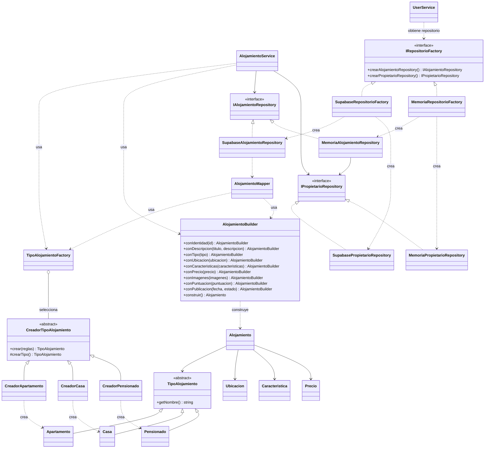

# Patrones de creación

Los tres patrones se integran en el backend. La configuración de producción sigue
utilizando Supabase en `backend/src/config/repositorios.ts`.

## Factory Method

`CreadorTipoAlojamiento.crear()` ejecuta el flujo común y llama al método
abstracto `crearTipo()`. Cada creador concreto implementa ese método y devuelve
su producto. `TipoAlojamientoFactory` conserva la API anterior y selecciona el
creador; la fachada por sí sola no constituye el Factory Method.

## Builder

`AlojamientoBuilder` reúne los datos mediante métodos encadenables y construye
una entidad completa. Valida campos requeridos, precio finito no negativo y fecha.
`AlojamientoService` lo usa para publicar y actualizar.
`AlojamientoMapper` traduce registros de Supabase a objetos de dominio usando el
builder; así ubicación, características y precio recuperan sus métodos.
La reconstrucción conserva ID, fecha, estado y puntuación almacenados.

## Abstract Factory

`IRepositorioFactory` declara la creación de dos productos relacionados:
`IAlojamientoRepository` e `IPropietarioRepository`.
`SupabaseRepositorioFactory` y `MemoriaRepositorioFactory` proporcionan las dos
familias. Cada fábrica mantiene sus instancias para compartir almacenamiento
dentro de la familia. Las fábricas en memoria independientes están aisladas.

La familia en memoria sirve para pruebas y demostraciones; almacena referencias
a objetos y pierde los datos al terminar el proceso. No sustituye la autenticación
ni las operaciones de perfiles que todavía acceden directamente a Supabase.
No representa un modo completamente desconectado de la aplicación.

Ejemplo de intercambio sin cambiar el servicio:

```typescript
const fabrica: IRepositorioFactory = new MemoriaRepositorioFactory();
const servicio = new AlojamientoService(
  fabrica.crearAlojamientoRepository(),
  fabrica.crearPropietarioRepository(),
);
// Registrar un propietario en esta familia antes de publicar.
```

## UML de clases

Se muestran las relaciones relevantes para los patrones. Las entidades existentes
`Alojamiento`, `TipoAlojamiento` y sus subclases conservan sus contratos.



## Archivos existentes modificados

- `backend/src/models/Factory/TipoAlojamientoFactory.ts`: selección de creadores.
- `backend/src/services/Alojamiento/alojamiento.service.ts`: construcción con builder.
- `backend/src/repository/SupabaseAlojamientoRepository.ts`: rehidratación con mapper.
- `backend/main.ts` y `backend/src/routes/alojamiento.routes.ts`: obtención de repositorios desde la fábrica.
- `backend/src/services/user.service.ts`: obtiene el repositorio desde la fábrica compartida.
- `backend/package.json`: comandos de pruebas y revisión de tipos.

## Validación

Desde `backend`, ejecutar `npm run typecheck` y `npm test`.
Las pruebas cubren selección y aislamiento de productos, validación del builder,
rehidratación, familias de repositorios e integración con el servicio.
Las pruebas de Supabase construyen los productos con configuración ficticia;
no realizan operaciones sobre una base de datos real.
